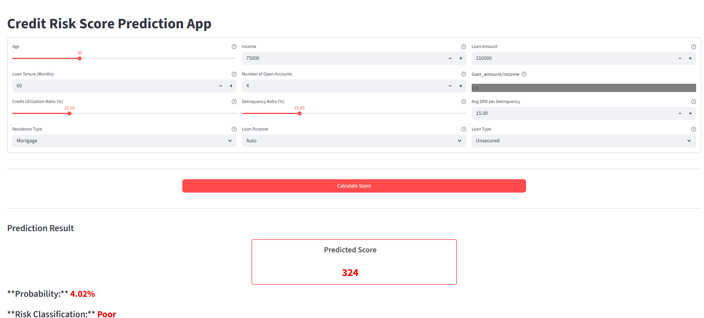

# 💳 Credit Risk Model — Lauki Finance

CreditRiskModel is a predictive analytics app designed for **loan risk assessment**. Built in collaboration with **AtliQ AI**, this tool empowers Lauki Finance to evaluate borrower creditworthiness using historical loan data and bureau metrics.

---

## 🚀 Overview

- 🔍 **Input**: Borrower demographics, loan details, bureau data  
- 🎯 **Output**: Default probability + Credit Rating (`Poor`, `Average`, `Good`, `Excellent`)  
- 🧠 **Model**: Logistic Regression (optimized via hyperparameter tuning)  
- 📊 **Best F1-score**: 0.946  

---

### 📸 Demo



---

## 📖 Scenario

Loan officers at Lauki Finance need to make fast, data-driven decisions. This app streamlines credit evaluation by predicting default risk and assigning a credit rating instantly.

---

## 💼 Business Impact

- 📉 Reduces loan default rates  
- ⏱️ Speeds up credit assessment  
- 📊 Standardizes scoring across teams  
- 🔗 Integrates into loan approval workflows  

---

## 🛠️ Tech Stack

🐍 **Python**  
📚 **scikit-learn**  
🧪 **pandas**, **NumPy**  
📊 **Logistic Regression** with hyperparameter tuning  
🧠 **NLP preprocessing** (for bureau text fields)  
🌐 **Streamlit** (UI)

---

## 📦 Dataset

- 🗂️ Historical loan records  
- 📄 Features: Demographics, loan amount, tenure, bureau metrics (credit utilization, open accounts)  
- 🎯 Target: Loan default indicator  

---

## 📈 Model Performance

| Class           | Precision | Recall | F1-score | Support |
|----------------|-----------|--------|----------|---------|
| 0 (No Default) | 0.99      | 0.93   | 0.96     | 11,423  |
| 1 (Default)    | 0.57      | 0.94   | 0.71     | 1,074   |

- ✅ **Accuracy**: 93%  
- 📊 **Macro F1-score**: 0.83  
- 🏆 **Best Trial Parameters**:  
  - `C`: 9.37  
  - `solver`: saga  
  - `tol`: 0.0178  

---

## 🧪 How It Works

1. Loan officer inputs borrower details  
2. Data is cleaned and vectorized  
3. Model predicts default probability  
4. Credit rating is assigned  
5. Result displayed in Streamlit UI  

---

## 🖥️ Streamlit App

# Clone the Repository

# Install dependencies
```  bash
    pip install -r requirements.txt
   ```

# Run the app
```   bash
    streamlit run app.py
   ```

---
